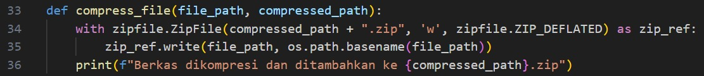
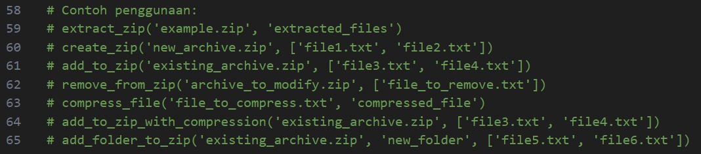

# LAPORAN UAS PBO

```markdown
# Penulis

- Muhammad Athaariq (NPM: G1R022023)
- Herdiansyah (NPM: G1F022057)
- Arief Haris Prasetyo Rizaldi (NPM: G1F022073)
```

# BAB I

## 1.1 Latar Belakang:

Dengan semakin berkembangnya penggunaan teknologi, kebutuhan untuk mengelola dan mentransfer file secara efisien menjadi semakin penting. Salah satu cara untuk mengatasi hal ini adalah dengan menggunakan file ZIP, yang membantu mengurangi ukuran file dan memungkinkan pengelompokan file terkait dalam satu arsip. Python menyediakan dukungan untuk operasi ZIP melalui modul `zipfile`, yang memungkinkan kita untuk melakukan berbagai operasi pada file ZIP dengan mudah.

## 2.1 Problem Statements:

1. **Ukuran File dan Pengelompokan:** Dalam situasi di mana file memiliki ukuran besar atau perlu dikelompokkan bersama, penggunaan file ZIP menjadi penting untuk mengoptimalkan ukuran dan organisasi.

2. **Operasi yang Diperlukan:** Dalam pengembangan aplikasi atau skrip Python, terdapat kebutuhan untuk melakukan berbagai operasi pada file ZIP seperti ekstraksi, pembuatan arsip baru, penambahan file, penghapusan file, kompresi file, dan penambahan folder beserta isinya ke dalam arsip.

## 3.1 Goals:

1. **Mengoptimalkan Ukuran File:** Tujuan utama dari penggunaan operasi file ZIP adalah untuk mengoptimalkan ukuran file, memungkinkan transfer dan penyimpanan yang lebih efisien.

2. **Kemudahan Penggunaan:** Menciptakan skrip Python yang sederhana dan mudah digunakan untuk melakukan berbagai operasi pada file ZIP tanpa memerlukan pengetahuan mendalam tentang struktur file arsip.

3. **Fleksibilitas Operasi:** Memberikan fleksibilitas kepada pengguna untuk melakukan operasi spesifik seperti penambahan file dengan kompresi, penghapusan file tertentu, dan penambahan seluruh folder ke dalam arsip.

## 4.1 Solution Statements:

1. **Fungsi Ekstraksi ZIP:**

   - Membuat fungsi `extract_zip` untuk mengekstrak isi dari file ZIP ke dalam direktori tertentu.

2. **Fungsi Pembuatan ZIP Baru:**

   - Membuat fungsi `create_zip` untuk membuat arsip ZIP baru berdasarkan daftar file yang diberikan.

3. **Fungsi Penambahan File ke ZIP:**

   - Membuat fungsi `add_to_zip` untuk menambahkan file ke dalam arsip ZIP yang sudah ada.

4. **Fungsi Penghapusan File dari ZIP:**

   - Membuat fungsi `remove_from_zip` untuk menghapus file tertentu dari arsip ZIP.

5. **Fungsi Kompresi File dan Penambahan ke ZIP:**

   - Membuat fungsi `compress_file` untuk mengompresi file dan menambahkannya ke dalam arsip ZIP dengan kompresi opsional.

6. **Fungsi Penambahan Folder ke ZIP:**
   - Membuat fungsi `add_folder_to_zip` untuk menambahkan seluruh folder beserta file-filenya ke dalam arsip ZIP.

## 5.1 Contoh Penggunaan:

Contoh penggunaan fungsi-fungsi tersebut dapat dilihat pada bagian terakhir dari kode yang telah Anda berikan. Dengan menggunakan fungsi-fungsi tersebut, pengguna dapat dengan mudah melakukan berbagai operasi pada file ZIP menggunakan Python.

# BAB II

# SOAL DAN PEMBAHASAN

## 2.1 Soal

Operasi dalam file Zip menggunakan python: File ZIP membantu mengurangi file besar dan menyatukan file terkait. Dengan menggunakan program sederhana python kita dapat melakukan operasi yang berbeda pada file zip.

## 2.2 Pembahasan

```markdown
# Deskripsi Singkat

Script ini menyediakan serangkaian fungsi untuk penanganan berkas zip, termasuk ekstraksi, kompresi, dan manipulasi.
```

## Fungsional

### 1. Ekstraksi Berkas Zip


Fungsi `extract_zip` digunakan untuk mengekstrak isi berkas zip ke direktori yang ditentukan.

```python
extract_zip('contoh.zip', 'berkas_diekstrak')
```

### 2. Pembuatan Berkas Zip


Fungsi `create_zip` membuat berkas zip baru dan menambahkan berkas yang ditentukan ke dalamnya.

```python
create_zip('arsip_baru.zip', ['berkas1.txt', 'berkas2.txt'])
```

### 3. Menambahkan ke Berkas Zip yang Ada


Fungsi `add_to_zip` menambahkan berkas baru ke dalam berkas zip yang sudah ada.

```python
add_to_zip('arsip_ada.zip', ['berkas3.txt', 'berkas4.txt'])
```

### 4. Menghapus dari Berkas Zip


Fungsi `remove_from_zip` menghapus berkas tertentu dari berkas zip.

```python
remove_from_zip('arsip_yang_akan_dimodifikasi.zip', ['berkas_yang_akan_dihapus.txt'])
```

### 5. Kompresi Berkas


Fungsi `compress_file` mengompresi satu berkas dan menambahkannya ke dalam berkas zip.

```python
compress_file('berkas_yang_akan_dikompres.txt', 'berkas_yang_dikompres')
```

### 6. Menambahkan ke Berkas Zip dengan Kompresi


Fungsi `add_to_zip_with_compression` menambahkan berkas ke dalam berkas zip dengan kompresi opsional untuk jenis berkas tertentu.

```python
add_to_zip_with_compression('arsip_ada.zip', ['berkas3.txt', 'berkas4.txt'])
```

### 7. Menambahkan Folder ke Berkas Zip


Fungsi `add_folder_to_zip` menambahkan folder beserta berkasnya ke dalam berkas zip.

```python
add_folder_to_zip('arsip_ada.zip', 'folder_baru', ['berkas5.txt', 'berkas6.txt'])
```

## Run Code

### 1. Membuat Zip


Siapkan 2 file untuk dibuat menjadi sebuah zip


Jalan kan kode sesuai dengan nama file yang sudah ingin dibuat menjadi zip dengan kode

```python
create_zip('ke1.zip', ['p1.txt', 'p2.txt'])
```


Dan bisa di lihat di Gambar di atas zip yang bernama `ke1` sudah berhasil di buat


Isi dari Zip `ke1` yang sudah di buat

## 2. Menghapus file dalam Zip


Jalan kan kode sesuai dengan nama file yang ingin dihapus dalam zip

```python
remove_from_zip('ke1.zip', ['p1.txt'])
```


file `p1` sudah berhasil dihapus

## 3. menambah file ke dalam Zip


Siapkan file yang akan di masukkan ke dalam zip, seperti mempersiapkan file bernama `p3` dan `p4`


Jalan kan kode sesuai dengan nama file yang ingin ditambahkan ke dalam zip

```python
add_to_zip('ke1.zip', ['p3.txt', 'p4.txt'])
```


Bisa dilihat untuk file `p3` dan `p4` sudah masuk ke dalam Zip `ke1`

## 4. Compress Zip


Disini saya memiliki file yang berukuran 14 kb dan akan saya compress


Jalan kan kode sesuai dengan nama file yang ingin dicompress

```python
compress_file('long.txt', 'setelahcompress')
```


Bisa dilihat file `long.txt` yang tadi berukuran 14 kb sudah di compress menjadi 8 kb dan sudah diubah menjadi sebuah Zip yang bernama `setelahcompress`

## 5. Menambahkan ke zip dengan compress


Jalan kan kode sesuai dengan nama file yang ingin dicompress dan ditambahkan ke dalam Zip


file `long.txt` sudah di berhasil di compress yang awal berukuran 14 kb seekarang menjadi 7 kb dan di tambahkan ke Zip `ke1`

## 6. Menambah folder ke dalam Zip


Jalan kan kode sesuai dengan nama folder dan file ke dalam Zip yang dituju

```python
add_folder_to_zip('ke1.zip', 'Onic', ['p1.txt', 'long.txt'])
```


Folder Onic sudah berhasil ditambahkan ke dalam ke dalam Zip `ke1`


Terlihat file `p1.txt` dan `long,txt` ada dalam folder Onic

## 7. Extract Zip


Jalan kan kode sesuai dengan nama Zip yang ingin diextract dan nama folder dimana hasil Zip akan di simpan

```python
extract_zip('ke1.zip', 'HasilExtract')
```


Extract berhasil dan hasil extract disimpan di folder `HasilExtract`


Folder `HasilExtract` yang mana isi nya file dan folder yang ada di Zip `ke1`

## 8. Contoh Penggunaan


Sertakan contoh kode di atas dalam skrip Python Anda untuk penanganan berkas. Sesuaikan jalur dan nama berkas sesuai dengan kebutuhan kasus Anda.

Silakan jelajahi dan modifikasi skrip berdasarkan kebutuhan Anda.

# BAB III

# KESIMPULAN DAN SARAN

## 3.1 Kesimpulan

Dalam pengembangan skrip Python untuk operasi pada file ZIP, Anda telah berhasil membuat serangkaian fungsi yang dapat melakukan ekstraksi, pembuatan, penambahan, penghapusan, kompresi, dan penambahan folder ke dalam file ZIP. Ini membantu mempermudah pengelolaan file dalam proyek atau aplikasi Anda.

Kode yang telah Anda buat relatif bersih dan mudah dimengerti, tetapi ada beberapa saran untuk meningkatkan fungsionalitas dan keterbacaan.

## 3.2 Saran

Untuk meningkatkan keterbacaan dan keberlanjutan kode, disarankan untuk menambahkan komentar dan dokumentasi yang menjelaskan setiap fungsi dengan baik. Selain itu, pastikan penanganan kesalahan yang memadai dan pertimbangkan untuk melakukan uji unit pada setiap fungsi. Jika proyek Anda berkembang, pertimbangkan penambahan fungsi yang sesuai dan pemeliharaan regulamen performa. Jangan ragu untuk memperkenalkan antarmuka pengguna atau fungsionalitas tambahan yang dapat membuat skrip lebih berguna dan mudah digunakan, terutama jika ditujukan untuk pengguna non-teknis. Dengan memperhatikan aspek-aspek ini, skrip Anda akan menjadi lebih solid, mudah dimengerti, dan siap untuk pengembangan masa depan.

# Daftar Pustaka

[1]
A. Warman, Unlocking the Hidden Power of Python: 27 Mind-Blowing Concepts That Will Transform Your Coding Journey!, Medium. (2023). https://addhewarman.medium.com/unlocking-the-hidden-power-of-python-27-mind-blowing-concepts-that-will-transform-your-coding-3fe8eff33ed4 (accessed December 16, 2023).

[2]
Python Module: Cara Mengimpor dan Membuatnya 2023 | RevoU, Revou.co. (2023). https://revou.co/panduan-teknis/python-module (accessed December 17, 2023).

[3]
Sigit Nurhanafi, Fungsi zip() pada Python: Menggabungkan dan Memanipulasi Data dengan Mudah, Pemburukode.com. (2023). https://pemburukode.com/fungsi-zip-pada-python/ (accessed December 16, 2023).

[4]
U. Aziz, Tambahkan File atau Folder ke Arsip ZIP dengan Python, Aspose Blog. (2023). https://blog.aspose.com/id/zip/create-zip-archives-in-python/ (accessed December 16, 2023).

‌
